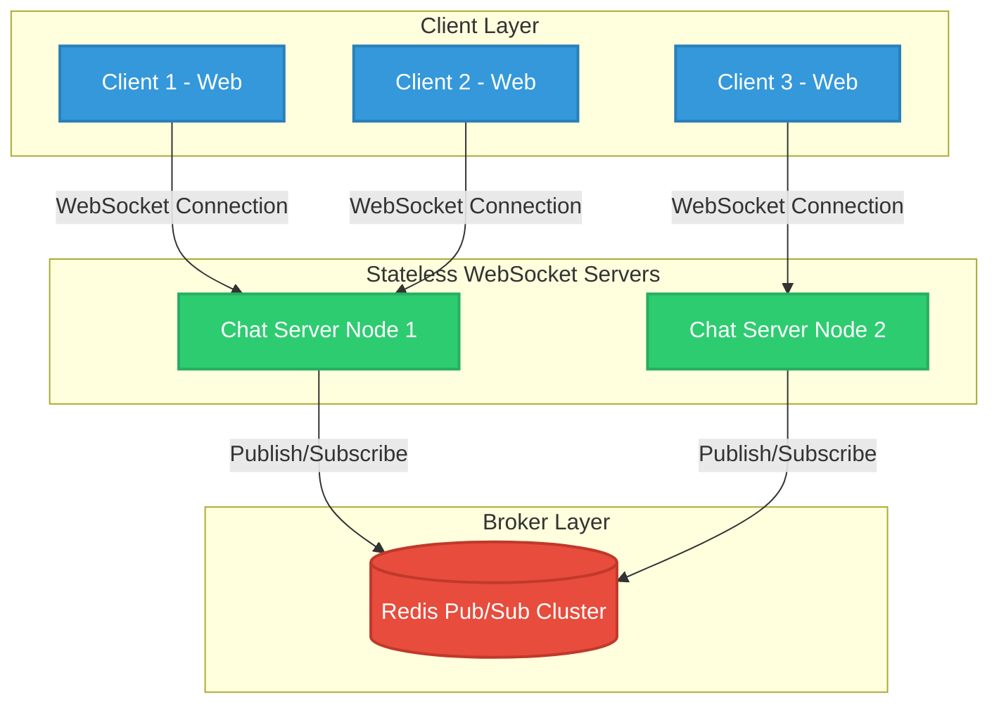

# Scalable Real-Time Chat Infrastructure

## Executive Summary

This repository implements a highly scalable, real-time messaging infrastructure designed to handle high-throughput concurrent WebSocket connections. By abstracting the transport layer and leveraging an event-driven architecture powered by Redis Pub/Sub, the system overcomes the inherent stateful limitations of single-node WebSocket servers. This guarantees seamless horizontal scalability, reliable cross-node communication, and low-latency message delivery across a distributed cluster.

## Technical Architecture

The system embraces a decoupled, event-driven architecture managed within a Turborepo monorepo to ensure strict boundary enforcement and optimized build pipelines. The frontend is driven by Next.js and React, while the backend utilizes Node.js and Socket.io.

To solve the critical challenge of inter-node communication during horizontal scaling, a Redis Pub/Sub layer acts as the centralized message broker. When a client emits a message to any node, the receiving server immediately publishes the payload to a Redis channel. The Redis broker then fans out this event to all subscribed server nodes in the cluster, which subsequently broadcast the message down to their respective connected clients. This architectural choice decouples WebSocket state from the individual application servers, transforming them into stateless components that can be dynamically scaled up or down based on traffic demands.



## Key Features & Engineering Highlights

- **Horizontal Scaling via Redis Pub/Sub:** Transforms traditionally stateful WebSocket connections into a stateless architecture. By using Redis as a high-throughput message broker, the system can seamlessly broadcast events across the entire server cluster without dropping messages.
- **Monorepo Architecture (Turborepo):** Facilitates shared dependencies, cohesive TypeScript configurations, and unified linting rules across multiple micro-applications. This reduces code duplication and leverages Turborepo's aggressive caching for rapid CI/CD pipelines.
- **Event-Driven Microservices Flow:** Employs an asynchronous, event-driven model ensuring that application servers remain unblocked during message propagation, keeping tail latencies low.
- **Containerized Infrastructure:** Core infrastructure dependencies (Redis, RedisInsight) are containerized via Docker Compose, guaranteeing parity between local development, testing, and production environments.
- **Strict Type-Safety:** End-to-end TypeScript enforcement guarantees contract validity between the Next.js frontend and Node.js backend, reducing runtime errors and improving developer velocity.

## Tech Stack

- **Languages:** TypeScript, Node.js
- **Frontend Framework:** Next.js 14, React 18
- **Backend Framework:** Node.js, Socket.io (`ioredis` for robust broker integration)
- **Data/Message Broker:** Redis 6
- **Tooling & Infrastructure:** Turborepo, Docker, Docker Compose, RedisInsight

## Getting Started

### Prerequisites

- Node.js (>= 18.x)
- Docker & Docker Compose
- npm (v10.x recommended)

### Local Development Setup

1. **Provision Infrastructure Services**
   Spin up the Redis broker and RedisInsight GUI in the background:

   ```bash
   docker-compose up -d
   ```

   *(RedisInsight is exposed at `http://localhost:9090` for real-time monitoring of pub/sub channels)*

2. **Install Workspace Dependencies**

   ```bash
   npm install
   ```

3. **Initialize the Development Cluster**
   Start both the Next.js web application and the stateless Socket.io server concurrently utilizing Turborepo's task runner:

   ```bash
   npm run dev
   ```

   - **Frontend Client:** `http://localhost:3000`
   - **Backend Server:** `http://localhost:8000`

## API Documentation

### WebSocket Events

#### `connection` (System Event)

- **Direction:** System -> Server
- **Description:** Fired upon successful Handshake and WebSocket upgrade. Used to track active socket references and metrics.

#### `event:message`

- **Direction:** Client -> Server
- **Payload:** `{ "message": "string" }`
- **Description:** Emitted by the client to dispatch a new message. The receiving server acts as a producer, serializing the payload and publishing it directly to the Redis `MESSAGES` channel rather than emitting it directly to clients.

#### `message`

- **Direction:** Server -> Client
- **Payload:** `string` (JSON stringified `{ "message": "..." }`)
- **Description:** Broadcasted by the server to all locally connected clients. This event is triggered internally when the server (acting as a consumer) receives a message broadcast from the Redis subscription channel.
